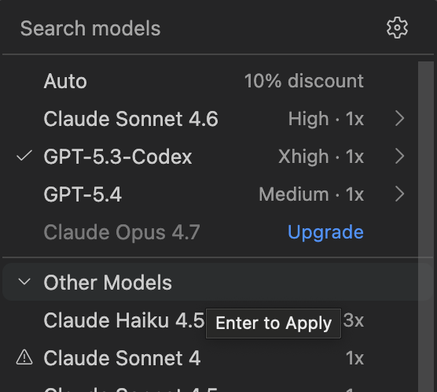
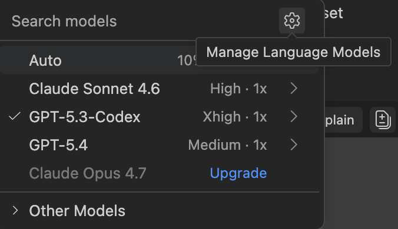
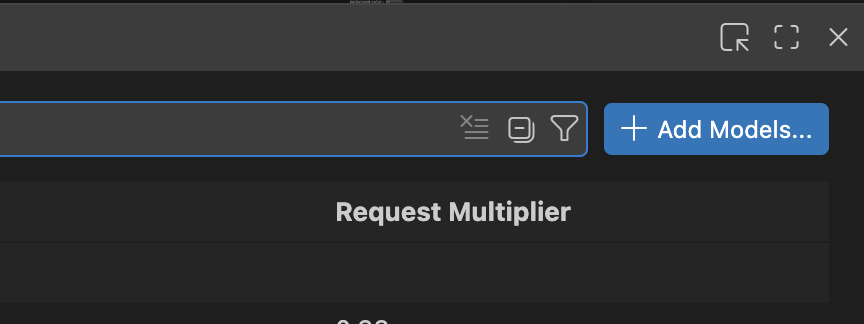
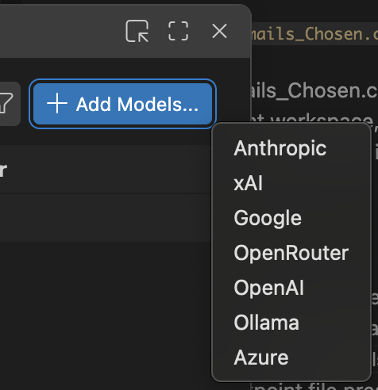
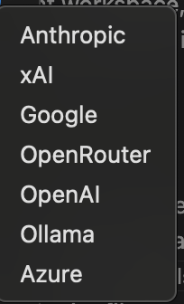
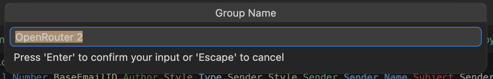
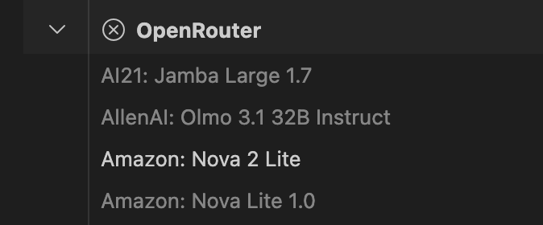

# Add OpenRouter Models to Visual Studio Code

This guide shows how to add your OpenRouter API key and enable OpenRouter models in VS Code using the exact UI flow shown in your screenshots.

## Before You Start

1. Create or copy an OpenRouter API key from https://openrouter.ai/keys.
2. Make sure your VS Code AI extension supports custom model providers and shows the Add Models button.

## Step 1: Open the model picker

In your chat/completions UI, open the model selector so you can see Search models.

## Step 2: Open Manage Language Models

In the Search models popover, click the gear icon in the top-right corner.

## Step 3: Click Add Models

After opening model management, click Add Models.

## Step 4: Choose OpenRouter as the provider

Open the provider dropdown from Add Models and select OpenRouter.

## Step 5: Name the model group

When prompted, enter a group name (for example, OpenRouter 2) and press Enter.

## Step 6: Enter your OpenRouter API key

After selecting OpenRouter, VS Code should prompt for your API key.

1. Paste your key (typically starts with sk-or-v1-...).
2. Confirm with Enter.
3. The key is saved in your secure credentials store (Keychain on macOS).

If no API key prompt appears, reopen Add Models for OpenRouter or remove and re-add the OpenRouter provider.

## Step 7: Verify OpenRouter models loaded

You should now see an OpenRouter group with available models.

## Step 8: Select and use a model

Go back to Search models, open Other Models if needed, highlight the model you want, and press Enter to apply.

## Quick Troubleshooting

- OpenRouter is missing from Add Models:
	Update VS Code and your AI extension, then reload the window.
- No models appear under OpenRouter:
	Check OpenRouter account credits and key permissions, then re-add the provider.
- Authentication error:
	Re-enter or rotate your API key.
- Model responds slowly or fails:
	Try another model in the OpenRouter list and check provider status.

